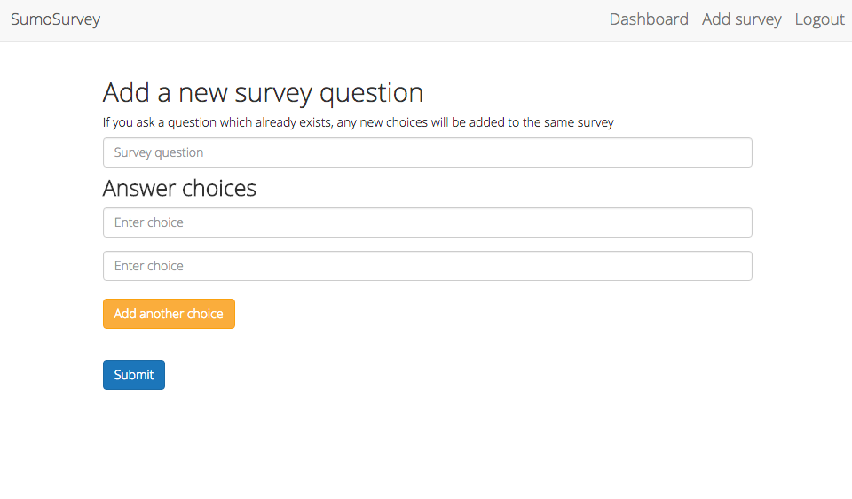

# SumoSurvey

> Features

- Users can respond to random survey questions.
- Questions that are already answered are not shown again to that user.
- Admin can log in to view survey responses.
- Admin can add survey questions/ answers.

## Stack
- Node.js/Express server
- MySQL database with Sequelize.js ORM
- AngularJS front-end MVC
- Bootstrap CSS

## Creator
- Austin Worachet [blog](http://austinwo.com)

## Development

### Installing Dependencies

From within the root directory:
```sh
* sudo npm install
* bower install
```

### Setting up DataBase development environment

```sh
mysql.server start
mysql -u [your username] -p
Enter Password:  [your password]
```

```sh
create database survey;
use survey;
```

### In server/db/models.js, set your mysql username and password in the configuration object

```sh
var sequelize = new Sequelize('survey', 'yourMySQLUsername', 'yourMySQLPassword');
```

When the app is started (server/app.js), the schema will be created so long as this setup has been performed.


From root directory:
```sh
node server/app.js
```

Open browser and navigate to http://localhost:5000

### Server-Client Architecture


### Screenshots



